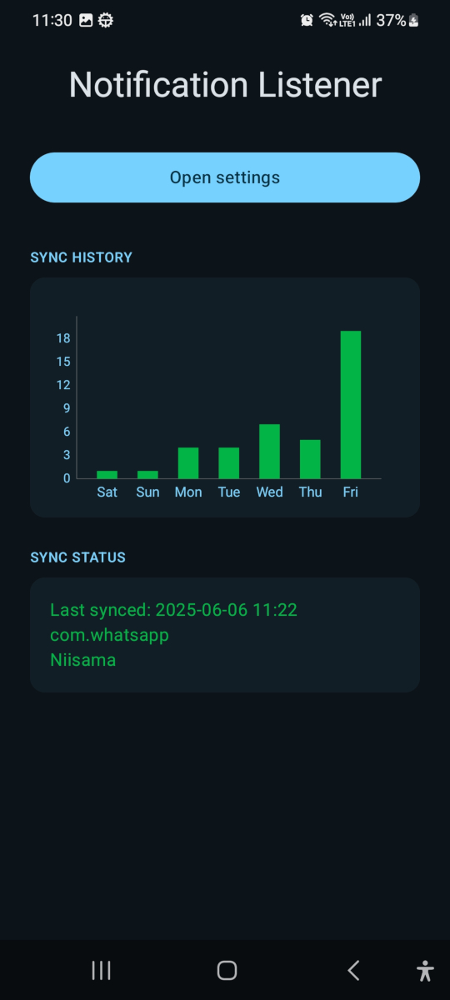
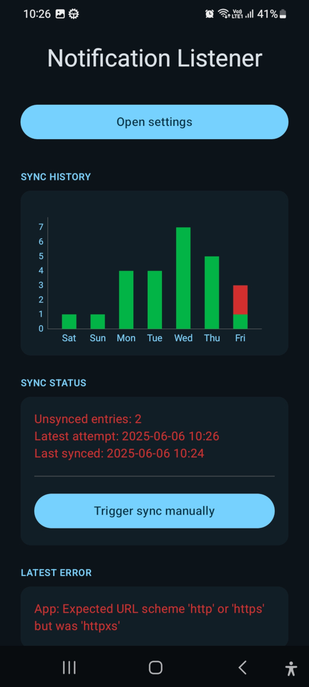
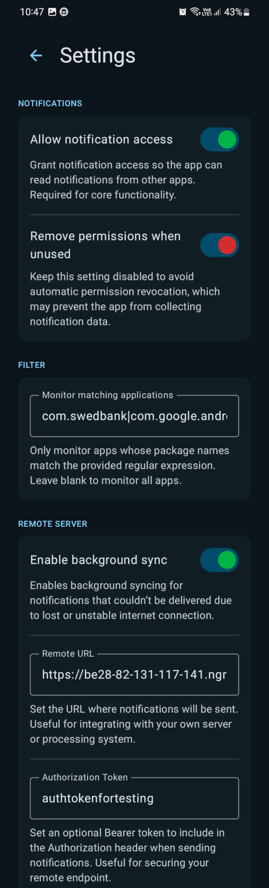

#  Android Notification Listener

A simple Android app that listens to notifications from other apps and sends them to a user defined server for further processing.

The notification payload is sent to the server in format as the example below:

```json
{
    "id": "b12fcbbc3152e4e8d3af3f4561e4049fd89cf0764e2b6d18561a1b9961d92be4",
    "packageName": "com.android.systemui",
    "key": "-1|com.android.systemui|2131428972|charging_state|10044",
    "title": "Wireless charging (1 h 26 m until full)",
    "text": "42% (1 h 26 m until full)",
    "subText": "",
    "bigText": "42% (1 h 26 m until full)",
    "category": "sys",
    "time": 1749199999562
}
```

Notifications are sent as they are received, but also stored in a local database in case the server is unreachable. 
Background sync for unsynced notifications is attempted every 15 minutes, and the app will retry sending notifications until the server acknowledges them with a [200..300) HTTP status code.

Remote server URL and optional authentication token can be set in the app settings (see below for example screenshots).

## Preview



## Installing dev version via Android Studio

### On your phone

- Enable developer mode on your Android device
    - 1 Go to "Settings"
    - 2 Tap "About device" or "About phone"
    - 3 Tap “Software information”
    - 4 Tap "Build number" seven times. ...
    - 5 Enter your pattern, PIN or password to enable the Developer options menu.
    - 6 The "Developer options" menu will now appear in your Settings menu.

### On your pc

- Install Android studio

### In Android studio

- Device Manager > Pair Device Using Wi-Fi > ... follow instructions

- Run 'AndroidNotificationListener.app' to install or apply changes

## Testing locally with [ngrok](https://ngrok.com/) and [netcat](https://linux.die.net/man/1/nc)

```bash
ngrok http http://localhost:8080
```

```bash
while true; do
  {
    echo -e "HTTP/1.1 200 OK\r\nContent-Length: 2\r\n\r\nOK"
  } | nc -l 8080
done
```

## Example images





## Authors

- Jaak Kütt [jaakkytt](https://github.com/jaakkytt)

## Contribution

This is a niche application designed to solve a specific problem, so I'm not actively seeking for feature requests that go beyond the scope of the original idea.

If you’ve found a bug or have a suggestion for improvement, please start by creating an [issue](https://github.com/jaakkytt/android-notification-listener/issues).
